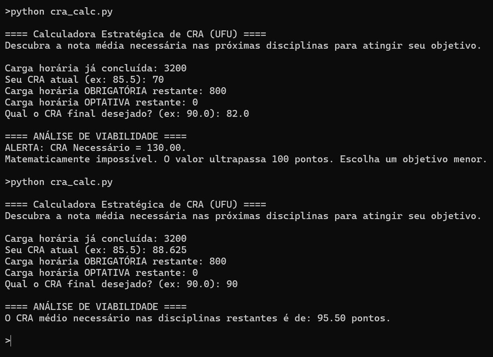

# Calculadora Estratégica de CRA (UFU)

Calcula a nota média necessária nas disciplinas restantes para
atingir um CRA-alvo até o fim do curso.



## Motivação

O sistema acadêmico mostra o CRA já obtido. O que eu precisava
era do inverso: dado onde estou e quanto falta, qual desempenho
médio a meta exige daqui pra frente — e se ela ainda é possível.

## Decisões técnicas

Interface de linha de comando, Python puro, sem dependências.

Cada entrada fica num laço que repete a pergunta até receber um
número válido, em vez de encerrar o programa com erro. Vírgula
decimal é convertida para ponto, cobrindo o hábito de digitação
brasileiro. O caso de zero horas restantes é tratado antes da
divisão e devolve mensagem própria.

## A regra de negócio

O CRA é uma média ponderada pela carga horária. O programa isola
a incógnita do desempenho futuro:

$$CR_F = \frac{(CR_D \times H_T) - (CR_A \times H_A)}{H_F}$$

- `CR_F` — CRA necessário nas horas restantes
- `CR_D` — CRA desejado ao fim do curso
- `CR_A` — CRA atual
- `H_A` — horas já concluídas
- `H_F` — horas restantes (obrigatórias + optativas)
- `H_T` — horas totais (`H_A + H_F`)

Se `CR_F` passa de 100, a meta é inalcançável mesmo com nota
máxima em tudo, e o programa avisa em vez de devolver o número
sem contexto.

## Como executar

```bash
git clone https://github.com/brunocesarcomp/calculadora-cra-ufu.git
cd calculadora-cra-ufu
python cra_calc.py
```

Requisito: Python 3. Nenhuma biblioteca externa.

## Melhorias futuras

- Rejeitar cargas horárias negativas
- Limitar o CRA de entrada ao intervalo de 0 a 100
- Tratar resultado negativo com mensagem própria
- Ler a carga horária direto do histórico exportado